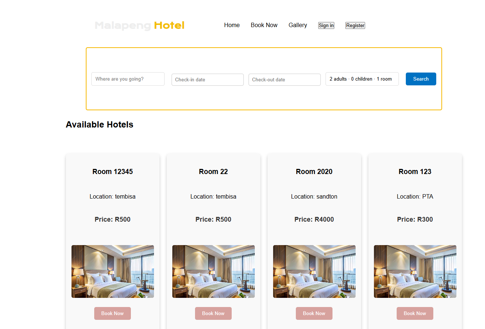
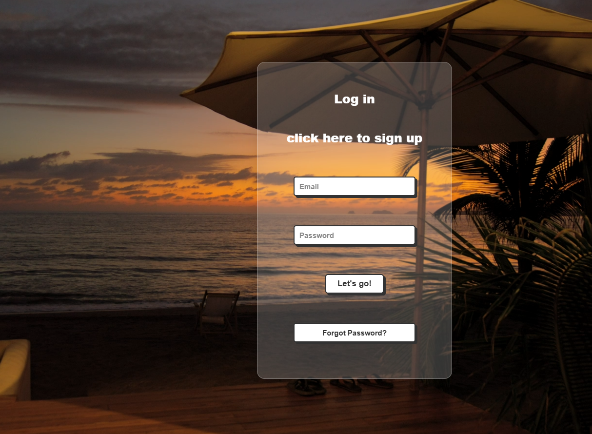

## Overview
A comprehensive hotel booking app that allows users to explore, book, and manage accommodations. This app includes user registration and login with Firebase Authentication, extensive booking and payment functionalities, user profiles, and an admin panel for managing accommodations and reservations.

## Features
`User Authentication`
Register and Login using Firebase Authentication for secure access.
`Accommodation Listings`
Browse and Filter Accommodations with comprehensive details:
Photo Gallery: Images of the hotel.

Pricing Information: Cost per night or custom pricing.
Basic Information: Address, star rating, and other details.
Hotel Facilities & Policies: Information on amenities and hotel policies.
`Action Buttons:`
Book Now or View Details.
Share: Share accommodation details with others.
Favourites: Save accommodation to favourites for future reference.
Booking Functionality
Book accommodations with the following features:
Date Selection: Select check-in and check-out dates.
Guest & Room Selection: Choose the number of rooms and guests.
Payment Integration: Process payments via a secure payment gateway.
User Profile
Profile Management: Edit profile details and view booking history and favourites.
## Admin Panel
Admin-Only Access for managing accommodations and bookings.
Add New Accommodations: Include room type, capacity, price, and availability.
View Reservations: View bookings, including guest and reservation details.
Manage Reservations: Approve, modify, or cancel reservations.
Update Accommodation Details: Adjust availability, pricing, and descriptions.
Additional Features
Search Functionality: Search for accommodations by location, price, and other filters.
Reviews & Ratings: Users can leave reviews and rate accommodations.
Notifications: Send notifications for booking confirmations, updates, and promotions.
Scalability & Performance: Optimized for high user volumes and efficient data handling.
Security & Compliance: Includes data protection and transaction safety.
Responsive Design: Works seamlessly on various screen sizes and devices.
## Tech Stack
Frontend
React: For building interactive UI components.
Redux: State management across components.
CSS/Styled Components: Responsive and scalable UI design.
Backend
Firebase Authentication: Secure user login and registration.
Firebase Firestore/Realtime Database: Storing accommodation listings, user data, and bookings.
Payment Gateway: A secure third-party payment provider (e.g., Stripe, PayPal).
## Additional Libraries
Moment.js: Date handling for bookings.
React Router: Navigation within the app.
Firebase Functions (optional): For additional server-side logic if needed.
Installation & Setup
Clone the repository:

## bash
Copy code
git clone https://github.com/yourusername/hotel-app.git
cd hotel-app
Install dependencies:

bash
Copy code
npm install
Configure Firebase:

## Set up a Firebase project at Firebase Console.
Enable Authentication (Email/Password).
Enable Firestore Database and create necessary collections (e.g., accommodations, users, bookings).
Enable Cloud Functions if needed for server-side operations.
Update Firebase configuration in the project with your API keys.
Setup Payment Gateway:

Register on a payment platform (e.g., Stripe or PayPal).
Integrate the payment API in the booking section of your app.
Run the App:

bash
Copy code
npm start
Access the app at http://localhost:3000.

### Home Screen (landing page)

*The first page of the website *

### RoomCards (booking )

*Cards where users book rooms *

### Login  (user/admin login apge )

*where users log in to access the payment gateaway *

